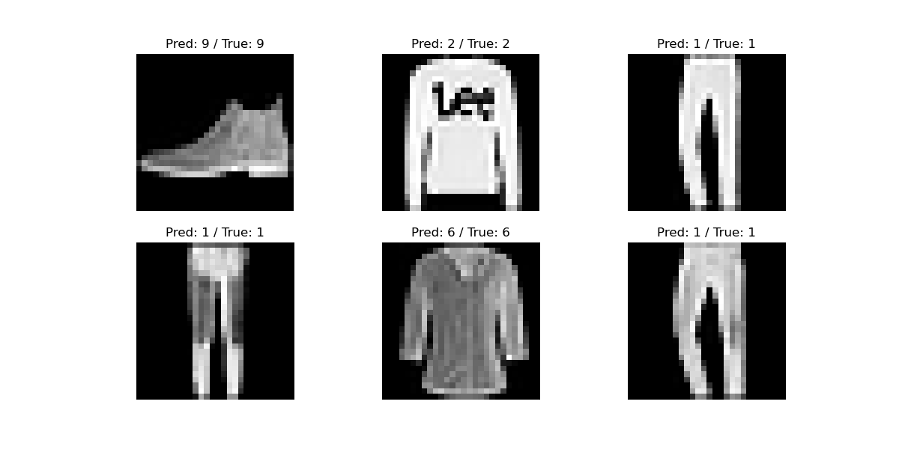

# CustomCNN-FashionMNIST

This repository contains the implementation of a custom Convolutional Neural Network (CNN) to classify images from the FashionMNIST dataset. The model is designed to showcase advanced features like data augmentation, regularization, and dynamic hyperparameter tuning.


## Features

- **Custom CNN Architecture**: Includes multiple convolutional layers, batch normalization, dropout regularization, and fully connected layers.
- **Data Augmentation**: Random rotations and horizontal flips to improve model generalization.
- **Dynamic Hyperparameters**: Adjustable learning rate, batch size, dropout, and number of epochs via command-line arguments.
- **Visualization**: Generates confusion matrices and displays sample predictions for better model interpretation.
- **Performance Tracking**: Logs training and validation accuracy to identify overfitting or underfitting.


## Installation

Clone this repository to your local machine:
```bash
git clone https://github.com/cxycode32/CustomCNN-FashionMNIST.git
cd CustomCNN-FashionMNIST
```

Install the required dependencies:
```bash
pip install -r requirements.txt
```


## Usage

Run the training script with default parameters:
```bash
python main.py
```

Customize hyperparameters using command-line arguments:
```bash
python main.py --learning_rate 0.0005 --batch_size 32 --num_epochs 20 --dropout 0.4
```


### File Structure

```
├── assets/  # Images of accuracy plot, confusion matrix, and test result
├── main.py  # Main script for training and evaluation
├── README.md               # Project documentation
└── requirements.txt        # Required dependencies
```


## Results

- **Final Test Accuracy**: The model achieves competitive performance on the FashionMNIST dataset.
- **Confusion Matrix**: Provides detailed insights into classification performance for each class.


## Visualization

### Training and Validation Accuracy

The accuracy of the model during training and validation is plotted to monitor progress:


### Confusion Matrix


### Test Result




## Contribution

Feel free to fork this repository and submit pull requests to improve the project or add new features.


## License

This project is licensed under the MIT License.
